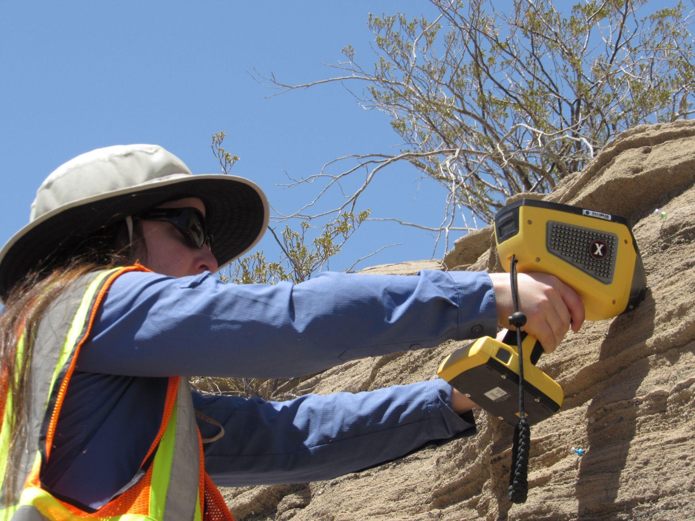
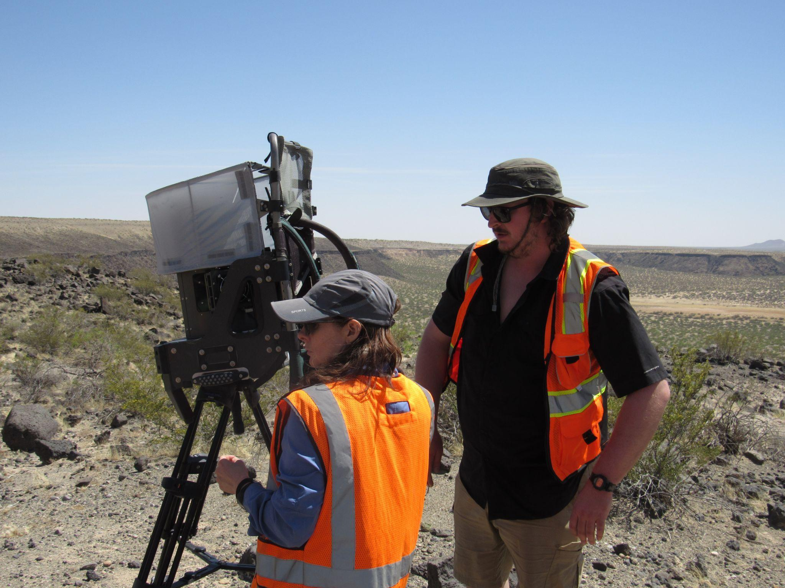

Along with the human crew, the rocket blasting back to the Moon as part of the Artemis Project in 2025 will be carrying an array of highly sensitive gadgets to help the astronauts do dangerous and important jobs in space.  Some of the machines used on Earth to analyze the features of analog sites like Kilbourne Hole in New Mexico will likely take the journey – or at least some instruments derived from those trusty monitors will, NASA scientists said.

The machines range from the handheld variety to those that stand on a tripod like a movie camera, to ones that are stuffed into a backpack and ones that hover hundreds of feet above the surface taking aerial readings. Scientists use the machines designed for analyzing objects in space on Earth-bound spots like Kilbourne and Hunt’s Holes because they have a similar geology and composition to that of the Moon.

Three such gadgets that scientists used during a trip to the Potrillo Volcanic Field in late April 2022 are the Kinematic Navigation and Cartography Knapsack, the X-Ray Spectrometer, or XRS and the Hyperspectral Thermal Infrared Sensor. 

NASA scientists Paul Bremmer of Johnson Space Center in Houston and Michael Zanetti of NASA’s Marshall Space Flight Center in Huntsville, Alabama, took measurements with the Kinematic Navigation and Cartography Knapsack, nicknamed KNaCK, a precise instrument used to analyze topography and create maps by shooting out millions of points of light per second to get accurate measurements. The team designed it to mount on a backpack attachment for easier transport. Scientists hope to attach it to a rover on the Moon or Mars and produce precise three-dimensional topographic maps of the lunar or Martian surface. In order to do this, the scientists must work on downsizing the KNaCK. The maps it churns out will help to make it safer for astronauts and rovers so that they know when to expect hazards on the ground.

“Basically, the sensor is a surveying tool for both navigation and science mapping, able to create ultra-high-resolution 3D maps at centimeter-level precision and give them a rich scientific context,” Zanetti said in an article about the cool gadget on NASA’s website. “It also will help ensure the safety of astronauts and rover vehicles in a GPS-denied environment such as the Moon, identifying actual distances to far-off landmarks and showing explorers in real time how far they’ve come and how far is left to go to reach their destination.”

Amy McAdam of NASA’s Goddard Space Flight Center operates the X-Ray Spectrometer, or XRS. It’s used to analyze the mineral composition of rocks and outcrops. While at Kilbourne Hole, McAdam used this instrument after larger surveys of the rock beds were analyzed. The XRS works by using charged particles in order to get x-ray spectrometry of the elements that were surveyed.

<figcaption class="rr-caption" align="center">Amy McAdam using the XRS on a sample.</figcaption>

Stony Brook University geologist Deanne Rogers stood in the hot sun at Hunt’s Hole peering into the massive hyperspectral thermal infrared sensor. The instrument, which stands on a tripod, uses the long wavelengths of infrared light to analyze the chemical composition of a larger rock field, scanning wide areas of outcrops. The data from this instrument shows the composition of the minerals that are not visible to the naked eye. In the field, Rogers worked with McAdams to analyze the chemical composition at specific points on the rock bed,

In their own ways, these three instruments are playing an important role in 
future space exploration.

<figcaption class="rr-caption" align="center">SBU Geologist Deanne Rogers and SBU graduate student Reed Hopkins, using the hyperspectral thermal infrared sensor.</figcaption>