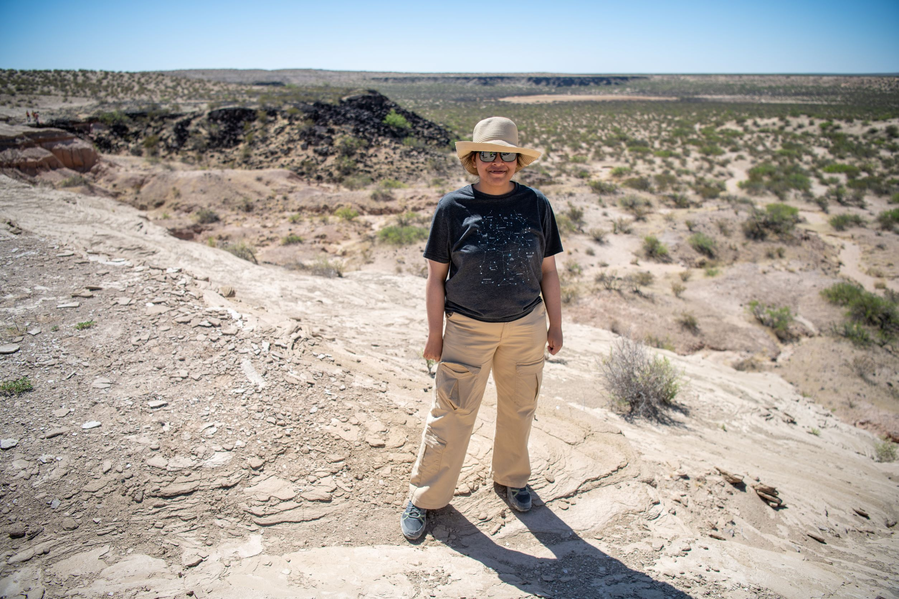
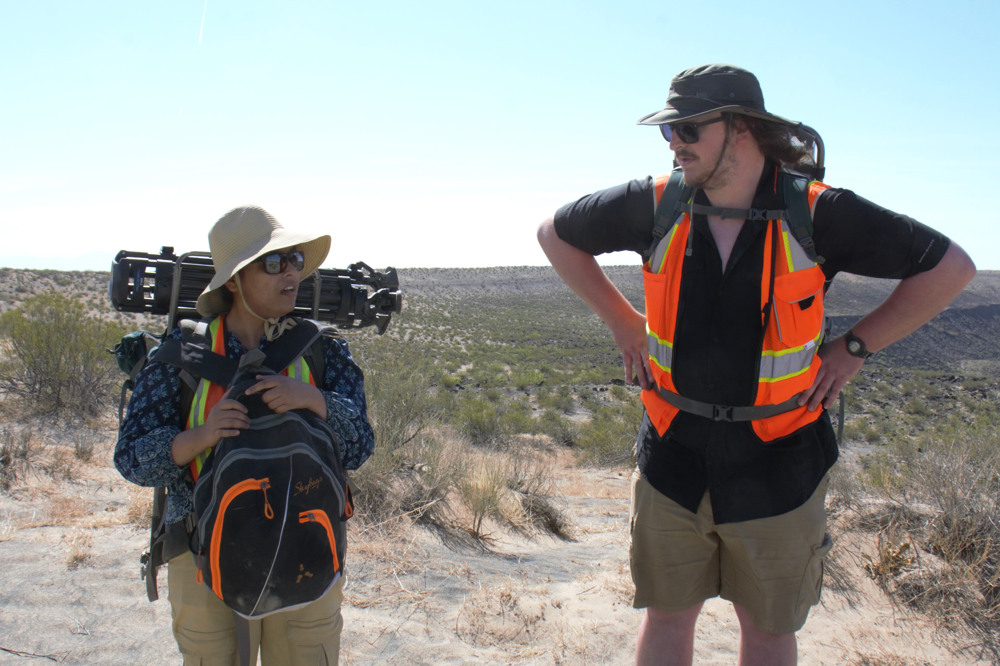

A couple of minutes after noon at Kilbourne Hole, an elliptical-shaped volcanic crater in New Mexico, Nandita Kumari rests on a boulder-sized basalt rock. She sets her clipboard and iPad aside to unwrap a granola bar.

She spent the morning doing data collection and rock identification for each extravehicular (EVA) traverse. For each EVA walkthrough — approximately 60 to 70 minutes — Kumari records the observations of scientists at each site, makes note of what rock sample they would take (they don’t actually take the rocks), and measures the readings from the handheld spectrometer on the iPad.

Thirty minutes later, Kumari is back in the field, clipboard, and iPad in hand, explaining the properties of quartz. The data and observations from scientists, Kumari hopes, will give better insight into the eruptions that have occurred and the history of rocks that remain. 

“It’s nice to be in the field,” the third-year graduate student says, doing a quick scan of the desert’s horizon.

For students like Nandita Kumari, New Mexico is a time to start anew and make up for forgotten fieldwork time. 

One of the prospects of fieldwork is its in-person interaction — traveling, meeting with scientists, and sharing data. It is a crucial element of programs like geology, earth, and life sciences. These opportunities, however, would come to a halt due to the COVID-19 pandemic. 

She started graduate school in Fall 2019, ready for the research positions the Stony Brook geosciences department would have to offer, including an opportunity to work on the Diviner Lunar Radar Experiment (DLRE) alongside her advisor, Timothy Glotch. 

“It’s a really big opportunity to be a part of a mission team,” Kumari said. “People look out for each other and I think that’s really important at school. This kind of support.”

By the spring of 2020, field research opportunities were suspended as the scientific community. The logistics of what could be done during the pandemic were in limbo. Some scientific institutions like the American Geosciences Institute still offered a [summer 2020](https://www.americangeosciences.org/news/agis-2020-remote-summer-internships-provide-geoscience-policy-experience) internship opportunity, but to be conducted remotely.

These moments to conduct research in regions across the country, or even across the globe in some cases, were upended due to the pandemic, resulting in many students like herself missing out on chances to expand their in-person experience.

“The first two years kind of feel like they blended together,” said Reed Hopkins, geochemistry and planetary science Ph.D. student at Stony Brook University.

It’s not an unusual experience for students to feel as if they lost a sense of time in not being able to be out in the field. The “grand experience” Hopkins defines as the initial years of graduate school never happened for him due to events and opportunities being delayed.

“I would have a first experience at the beginning of my second year,” Hopkins said.

But he leans on the universal feeling that other science students share in their first time doing fieldwork to showcase the idea of normalcy for other students.

“Last time we went out here in November, it was like the first major trip that a lot of people did,” he said. “People would out here and work in the field. It was amazing.”

Starting new by working in the field was also categorized by a feeling of overwhelmingness, according to Linden Wike, University of Maryland geophysics grad student, who was also in New Mexico.

Wike, who does most of her work in a lab, described her first time doing fieldwork last November as “getting to apply things I’ve learned in class,” when it came to setting up physical experiments.

Ultimately, she found the atmosphere warm and welcoming to newbies like herself. 

“I was very nervous about what to expect and what the day would look like,” she said. “It seemed more laidback and everyone’s just getting their research done and working together.”

The imposed stress of the pandemic brought on unprecedented levels of stress for graduate students. Anxiety among graduate students increased by 50 percent, [according to a study](https://cshe.berkeley.edu/seru/about-seru/seru-surveys/seru-covid-survey-reports) conducted by Student Experience in the Research University (SERU).

Kumari was also facing an added layer of stress during the pandemic as her home country India was going through its peak pandemic cases.

“It was a very difficult time for me,” she said. 

Again, she credits Glotch and the rest of the department for being her support system with routine emails asking about her wellbeing and how her family in India was doing.

Even now as opportunities become more available, these positions were mostly for first-year graduate students. Despite having no field experience, as a junior, Kumari was seen as overqualified and missed out on many chances to get back into the field.

She has about a week left to work on the RISE2 project before heading to San Francisco for other projects and conferences.

“It’s been a weird thing, but I’m glad it’s working out now.”

