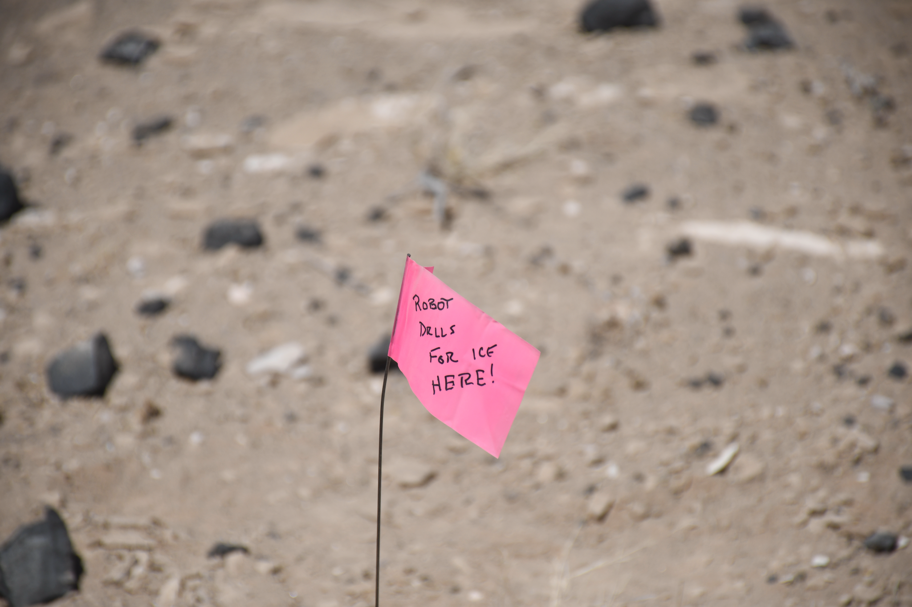

In April 2022, I stepped into the shoes of an astronaut.

Teams of NASA scientists gathered at the Potrillo Volcanic Field in New Mexico for a week’s worth of research to help send a crew of astronauts back to the moon and other planets.

I was fortunate enough to test out new methods that astronauts would use on a future mission to the moon, such as spacewalking or extravehicular activity (EVA). It was my job to find the basalt layer of rock some seven meters down into the earth for drilling in a seismic experiment.

Basalt at Potrillo is charcoal- or black-colored smooth rock commonly found around volcanic eruptions. Its low viscosity allows it to flow long distances. The purpose of this EVA was to lay down seismometers five meters apart from each other to conduct tests on the earth below. 

NASA Software Engineer Ben Feist was my partner during this astronaut training. Feist is a Spaceflight Data Researcher for NASA and Goddard Space Flight Center.

Our trek up the non-active volcano field was beautiful, considering the heat. The view was mesmerizing. We were able to see other mountains and other volcanoes miles away from us.

As we reached our location, the EVA began. Feist and I had to look at various printed maps with different data on each map. One of the maps showed the topography of the area we were researching. Another map had data regarding what was being found underneath us. 

As we continued, we followed the prompts to proceed with our research. As we looked at the maps, we had to figure out where would be an ideal place to find basalt around seven meters deep. We had three choices. Choice A was at the top of the mountain. Choice B was near the middle and option C was near the bottom. 

After looking around our surroundings, Feist and I  decided that we would try choice B first because it was in the middle. As we arrived at our B location, we had to measure 40 meters by placing a seismometer five meters apart with an extra five meters at the first and last seismometer. 

Placing the seismometer was the easy part. The reason behind hitting the ground near each seismometer is to collect the best possible data. With a sledgehammer, we would have to hit the ground up to 10 times to gather as much data from each seismometer. 

Each seismometer acts like a receiver, gathering data every time the sledgehammer makes contact with the ground. The impact of the sledgehammer at the first seismometer receives a strong signal as the vibrations from the first impact move further out. The data begins to get fuzzy, so gathering data from each seismometer is crucial.

After gathering the data we collected, we were shown the results depicting what was concluded during the seismometer collection. Each seismometer had a graph showing the quality of the information we collected. 

After reviewing our research, we looked over another data result from the seismometer, giving us a range of how deep the basalt was from our location. The results were pretty impressive as we were in the range of seven meters deep from basalt. 

The reasoning behind why this experiment is crucial to future moon travel was to know what was valuable and, most importantly, how smoothly the process can be.

The overall experience of the EVA from an outside point of view was highly informative. The people involved with the EVAs were experts in their respective fields, which made it a tremendous experience for me. 

The value of conducting research here on earth is critically essential to the success on the moon. The work done on earth paves the way for successful missions on the moon. 

The Artemis Project aims to send humans to the moon once again by 2025. The project entails sending a group of astronauts for a series of missions on the moon. The research that will be conducted will have scientists back on earth studying the data for years to come.