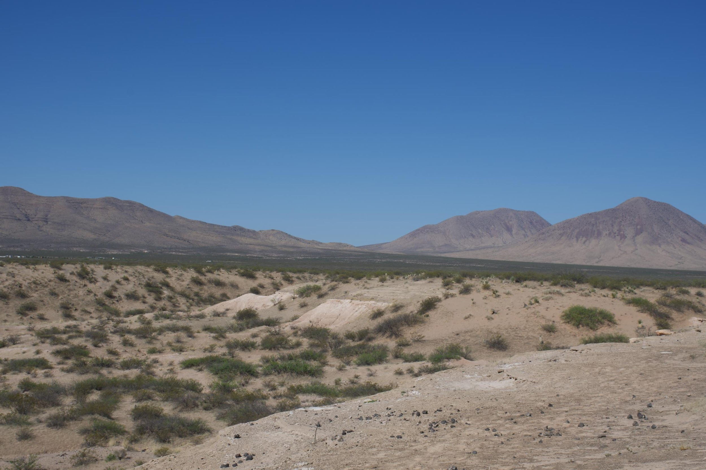
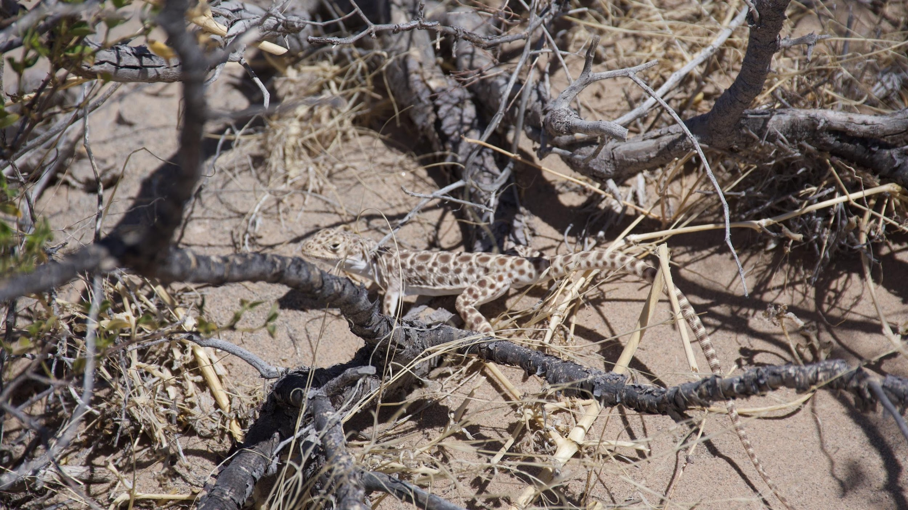
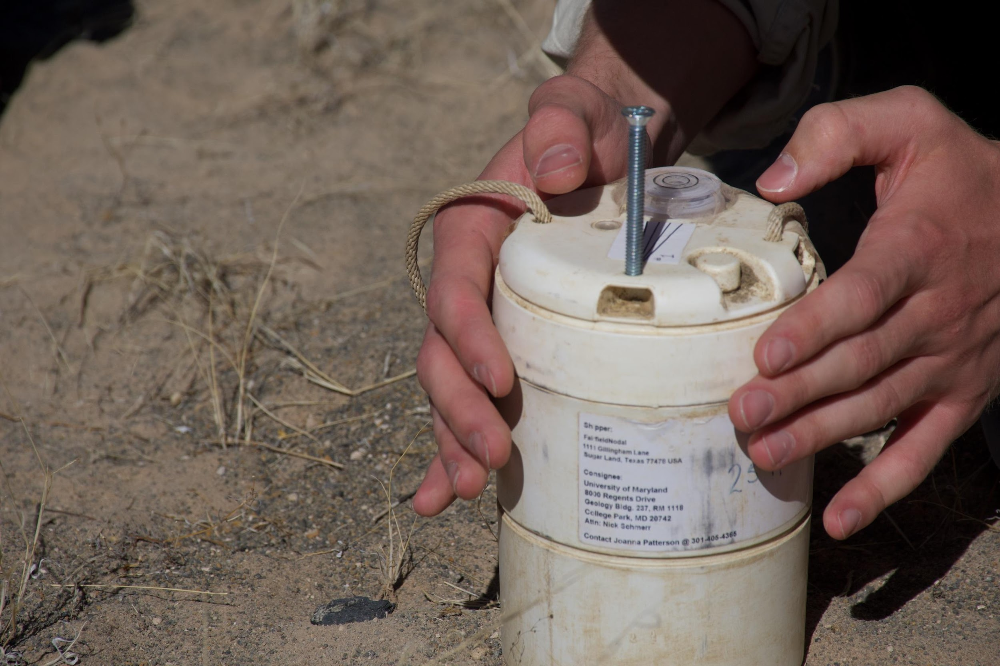
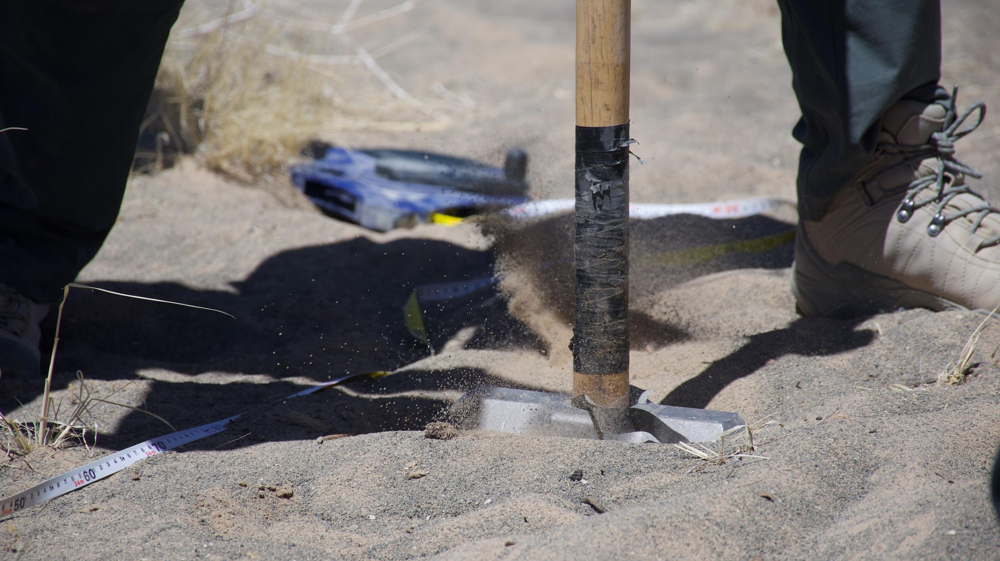
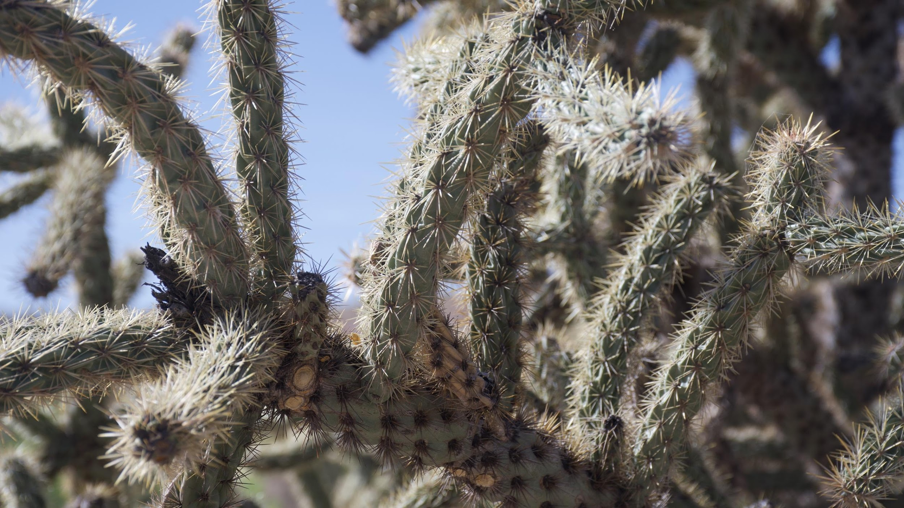
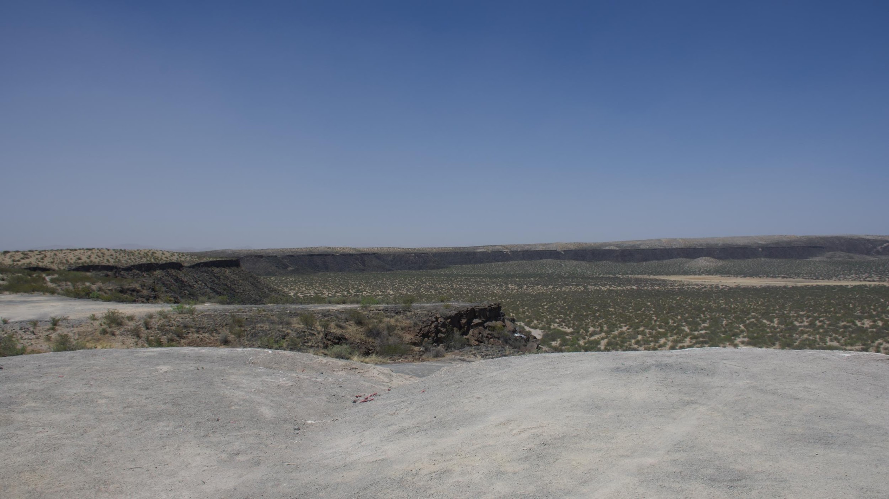
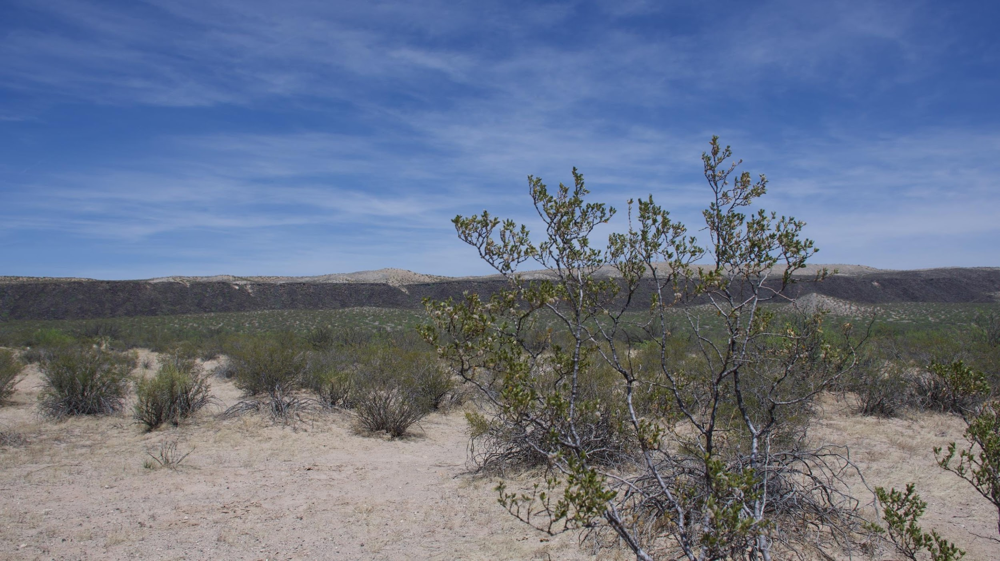
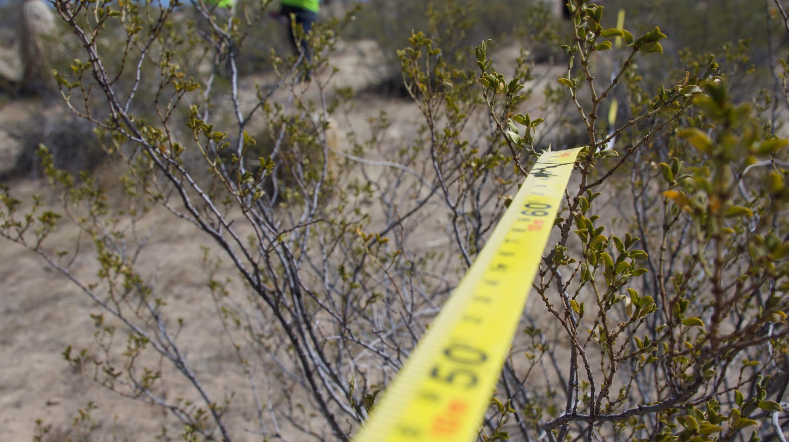
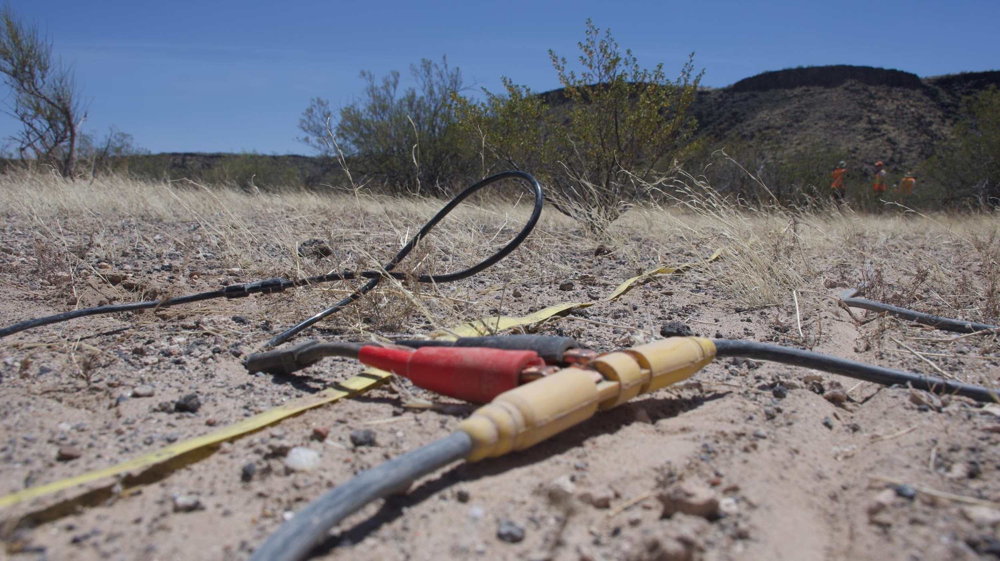
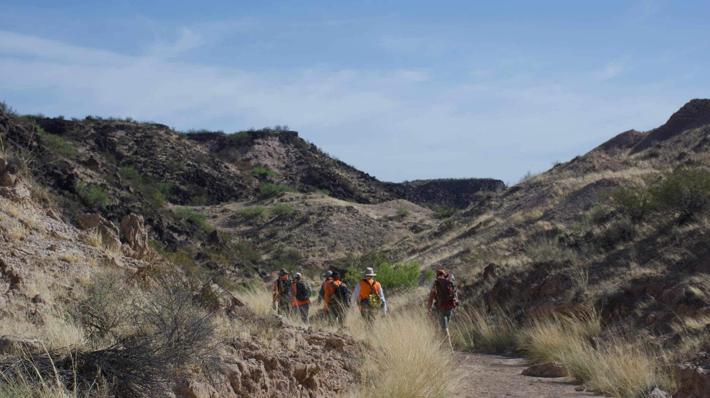

As I traipsed through the sands of Potrillo Volcanic Fields, sweat dripping off my brow, I couldn’t get over the fact that for geologists, this lifestyle is their 9-5. While craters might seem nothing more than a useless wasteland to some, they are a geologist’s paradise. Across three days, I gained insight on the immense preparation going into future space exploration, all while soaking up some of the most beautiful views I’ve ever seen. 

<figcaption class="rr-caption" align="center">Hunt’s Hole. Aside from being an extremely useful spot for scientific research, it’s perhaps the most beautiful place to pop a squat for a water break.</figcaption>

<figcaption class="rr-caption" align="center">With alleged scorpions, snakes, and rabbits lurking out of sight, this lizard appeared unafraid to be caught basking in the 80-degree sun.</figcaption>

<figcaption class="rr-caption" align="center">Skye Ray levels a geophone into the ground at Hunt’s Hole.</figcaption>

<figcaption class="rr-caption" align="center">The team trades off making strikes with the hammer, resulting in seismic data.</figcaption>

<figcaption class="rr-caption" align="center">One of many cactus plants found at Kilbourne Hole. </figcaption>

<figcaption class="rr-caption" align="center">The gorgeous view from atop Kilbourne Hole, which is over 1 mile wide.</figcaption>

<figcaption class="rr-caption" align="center">The view from inside Kilbourne Hole.</figcaption>

<figcaption class="rr-caption" align="center">The GEODES team (Geophysical Exploration of the Dynamics and Evolution of the Solar System) lays out a measuring tape in preparation for seismic testing.</figcaption>

<figcaption class="rr-caption" align="center">Geophones plugged into the electrical line that will send seismic data to a computer.</figcaption>

<figcaption class="rr-caption" align="center">The GEODES team embarks on the 2-mile hike out of Kilbourne Hole.</figcaption>