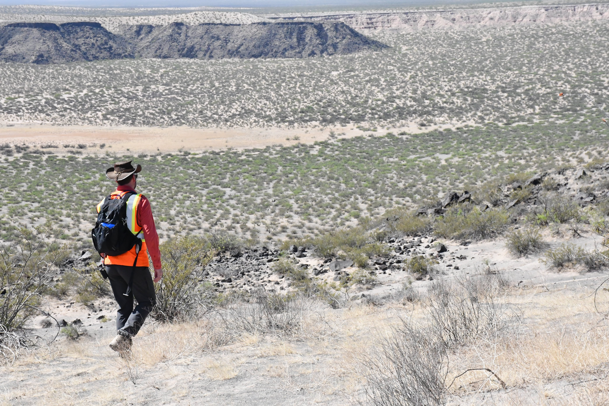
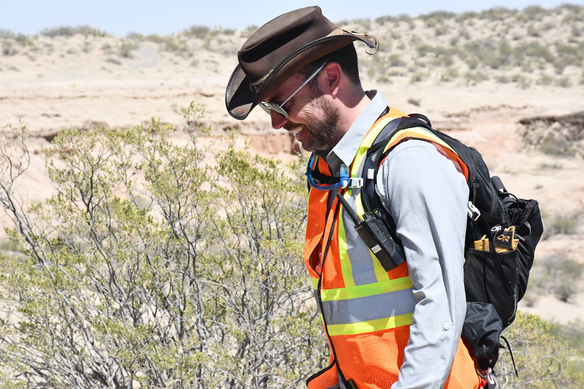
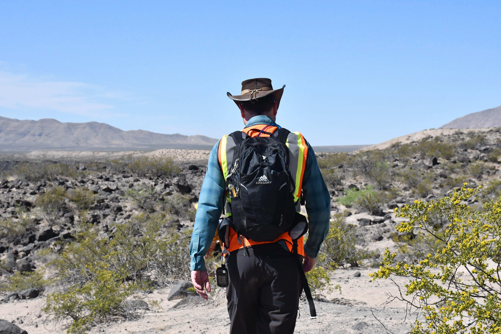

Ben Feist stood against the dusty wind at the Potrillo volcanic field. “Nothing like chasing your hat across the desert,” he quipped. The software engineer stood in the midst of a 400-square-mile otherworldly environment of parched land, craters and lava flows. 

He endured the New Mexican desert for NASA field work as the data subteam lead this past April. Field work is a rare opportunity for a computer scientist, he said. But Feist is familiar with the atypical; his path to NASA was unusual in itself. 

Feist did not attend graduate school. He did not climb the ladder at NASA, as he said many do. Instead he worked in the private sector for 22 years. Then, on evenings and weekends for six years, he created a project fueled solely by passion. 

It won him numerous awards — and it got him a job at NASA. The project was to recreate three of NASA’s Apollo space missions for the public to experience, titled Apollo in Real Time.

Feist researched, reconstructed archival material and coded a website that essentially rebuilt NASA’s historical records of Apollo 11, Apollo 13 and Apollo 17. The interactive, multimedia site features photographs, videos and audio of the original historical missions with synchronization and digital transcripts.

The public can relive the missions as they occurred in 1969, 1970 and 1972 by joining at one minute to launch, or by joining in-progress at exactly the same time they are visiting the site — only rewinding to over 50 years ago. 

The engagement time of ApolloInRealTime.org is over 10 minutes: an “eternity for Internet standards,” Feist said. 

The Apollo 17 virtual journey features all mission control film footage, all on-board television and film footage, 302 hours of space-to-ground audio, all on-board recorder audio, over 3,600 photographs and 35,800 searchable utterances.  

In response to Feist’s project, Noah Petro of NASA’s Goddard Space Flight Center in Maryland invited Feist to speak at the 44th anniversary of the Apollo 17 mission in December 2016. After the talk, NASA scientists Jacob Bleacher and Patrick Whelley said that Feist might have found an answer to a problem that had baffled NASA. And it had to do with contextual data.

Contextual data offers a broader look into the data collected by providing background information. In NASA’s case, the amount of data astronauts will collect on future missions will only continue to grow, especially from the era of the Apollo missions. Feist’s organization of data in [ApolloInRealTime.org](https://apolloinrealtime.org) has the potential to solve that problem, for it could be applied to organizing and analyzing field data. 

Feist created prototypes displaying how he could help the scientific community at NASA through organizing contextual data. It led to where he is now: a software engineer in data visualization and informatics in the Astromaterials Research & Exploration Science (ARES) division at Johnson Space Center in Houston as a Jacobs contractor since 2018.

<figcaption class="rr-caption" align="center">Ben Feist at the Potrillo volcanic field, New Mexico. April 2022. Photo by Melanie Formosa.</figcaption>

“I am part of a small team that designs and builds the systems for Artemis that will be used by mission control to plan and execute lunar space walks,” Feist said. NASA’s Artemis program is set to return astronauts to the Moon by 2025 and pave the way for human missions to Mars.

Feist is the creator of Collaborative Operations Data Activation (CODA), which is a team-effort, system-made software. “CODA is like a security camera,” Feist said. It is a “contextual playback of the data” and was first released in May 2021.

CODA is primarily used on the International Space Station (ISS) and contains all data collected since 2013. “It’s basically Apollo In Real Time for the space station,” Feist said. 

In April 2022, Remote, In Situ, and Synchrotron Studies for Science and Exploration 2 (RISE2) researchers returned to the Potrillo volcanic field in New Mexico to conduct an analog mission. The location, referred to as a planetary analog site, has extreme conditions that resemble other worlds, such as the Moon and Mars. 

“It is excellent to have Ben Feist on the field team,” said Whelley of NASA’s Goddard Space Flight Center. “His background is different from most of the team, so his questions are different, from a different perspective. This makes us geologists double check our assumptions and be more effective scientists.”
 
“Also,” Whelley continued. “Ben is a fun person to be around. If Ben is on the team, sign me up.”

On this past RISE2 trip, Feist was responsible for recording everything the mock astronauts completed on the scripted EVAs, including mock-up science data. EVAs, or extravehicular activities, are test experiments conducted outside a spacecraft. The EVAs at the Potrillo volcanic field were done by mock astronauts to help Artemis mission astronauts communicate with mission control.

<figcaption class="rr-caption" align="center">Ben Feist at the Potrillo volcanic field, New Mexico. April 2022. Photo by Melanie Formosa.</figcaption>

After gathering the scientific data in the field, Feist focused on putting it all into a contextual replay system, like CODA.

CODA stores test events, such as data collected from the RISE2 project, as well as activities that are conducted underwater in NASA’s Neutral Buoyancy Laboratory. CODA is time-based, so its emphasis is on when something occurred. It captures video, audio, field notes and telemetry, which monitors the battery level and motion sensors on a mock spacesuit at any given time. 

“Ben’s work is transforming RISE2 science,” said Cherie Achilles of NASA’s Goddard Space Flight Center. “By integrating individual datasets into a spectacular visual narrative, Ben is generating an integrative science product that is helping our science team understand the geologic history of Kilbourne Hole. He and the RISE2 science team are paving the way for how astronauts on the Moon can utilize in situ (on site) data to explore and investigate the lunar surface.”

Feist was always interested in space. He said the Apollo 13 movie with Tom Hanks “changed everything” for him. It’s what spurred his fascination with outer space — and with teamwork. 

The movie depicts the true story of figuring out a way to get astronauts back to safety after their spacecraft experiences massive internal damage. Feist perceives Apollo 13 to be the most important Apollo mission because of the teamwork and communication in the control room.

Feist values saying yes. “It’s the answer to challenges I don't know how I can possibly accomplish when they are given to me,” he said. “Instead of having doubts around myself and saying, ‘I'm not sure’ or ‘I'll see what I can do,’ I just say ‘yes.’ And then I throw myself at the problem and try to get it done.”

<figcaption class="rr-caption" align="center">Ben Feist at the Potrillo volcanic field, New Mexico. April 2022. Photo by Melanie Formosa.</figcaption>

Feist graduated from Trent University in Ontario with a bachelor of arts in English literature and computer studies in 1996. Before NASA, Feist designed and built interactive experiences in the web development consulting industry, and he ran the technology disciplines at several marketing agencies. 

This past year Feist won the Johnson Space Center Exceptional Software Award and the Johnson Space Center Director’s Innovation Award. He is the recipient of more than 20 honors and awards.

Yet Feist remains humble. Though grateful, the awards are not his motivation. Instead he chases the zeal, the thrill and the fulfillment of doing what he loves. “Not often in life do people get to work on things they really care about and also contribute to the future of humanity,” Feist said. “I feel like I’ve finally found a place that’s like that.”