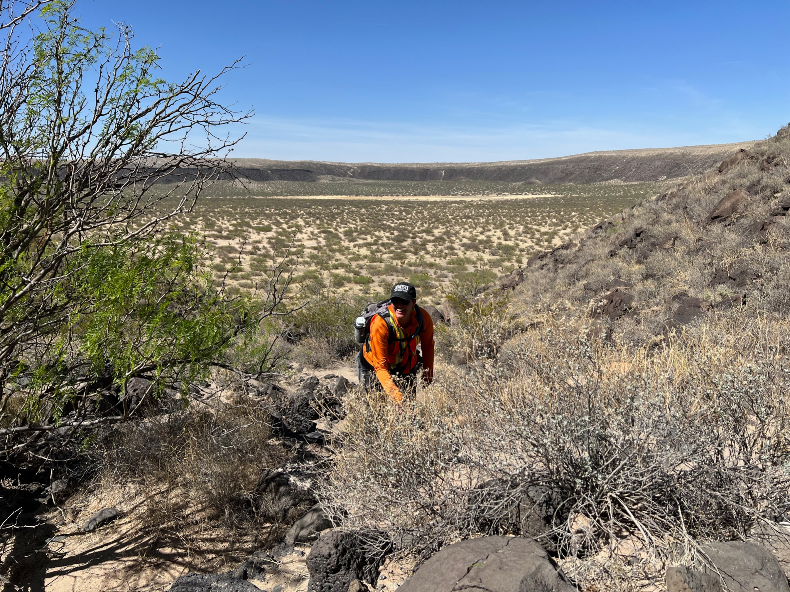

When Jacob Richardson enters a field site, he never knows what he’ll find. As lead investigator of the GEODES (Geophysical Exploration of the Dynamics and Evolution of the Solar System) team at NASA Goddard Space Flight Center, Richardson has traveled the world conducting geological research. Through utilization of geophysics, his team explores lunar lava flows and tectonic features on Earth to determine how they might relate to conditions on other planets. 

This past April, GEODES took part in RISE 2 Potrillo, an initiative funded by NASA in which scientists gathered to conduct experiments across New Mexico’s vast Potrillo volcanic fields. The site hosts an array of volcanoes that have been dormant for nearly 20,000 years.  

“This sort of project is what I’ve been aiming for since I started grad school,” Richardson said. 

On April 23, the GEODES team hiked 30 minutes into Kilbourne Hole, the largest volcanic crater in the Potrillo Volcanic field. The team focused primarily on analyzing seismic activity in the ground by laying out an electric geophone line. While one team member assessed the seismic wavelengths on the computer, another would strike a hammer into a metal plate to simulate seismic activity. 

<figcaption class="rr-caption" align="center">Richardson takes a break between hammer strikes at Kilbourne Hole.</figcaption>

The data collected from these man-made trials will provide better insight into the possibility of moonquakes occurring on the moon when astronauts are present, and provide insight to how they can respond should this happen. According to Richardson, the lack of gravity on the moon as compared to earth might make quakes less of a hazard on the moon. For example, a closed habitat might provide ample protection. Nonetheless, the ongoing research of his team and many others have one goal in mind: Safety. 

“We don't want to send people to another planetary body like the moon without really knowing what that risk is,” Richardson said. 

After nearly five hours of data collection and numerous water breaks, Richardson excitedly suggested that the team take the scenic–and trickier–hike up and out of the crater. As the team took breaks throughout the climb, Richardson offered to take pictures, encouraging them to embrace the current moment. 

<figcaption class="rr-caption" align="center">Shannon Rees makes the climb. Photo by Jacob Richardson.</figcaption>

Upon reaching the top, he set down his pack–complete with a car battery that was used to power the seismic equipment–and walked to the edge to enjoy the view. 

“Just beautiful,” he said. 

Members of Richardson’s field team at Potrillo included Linden Wike, a current doctoral candidate of Geology at University of Maryland. Set to graduate with her Ph.D. in 2025, Wike was recruited by Richardson in 2021 to join the GEODES team and remembers being drawn to his approachability. 

“I recall admiring how he was simultaneously professional and easy to approach on a more casual peer level in the field,” Wike said. 

Wike worked alongside Richardson on the RISE2 mission in 2021, and was eager to return with GEODES this year. Throughout this year’s trip, she served multiple roles including data collection.

<figcaption class="rr-caption" align="center">Wike shares seismic data with Richardson at Hunt’s Hole. </figcaption>

“Imposter syndrome is discussed a lot in our graduate program, especially between the female grad students, and I find it inspiring that I've never felt nervous to ask questions or felt inferior when I've interacted with Jacob,” Wike said. 

<figcaption class="rr-caption" align="center">Wike helps remove stakes of the geophone line from the ground. </figcaption>

Like many students entering college, Richardson hadn’t found his niche until a couple of semesters in. After taking a geology class, he became fascinated not only with science, but also the idea of studying the geophysical environment of other planets. 

After finding inspiration in being tasked to map out volcanoes on Mars at an internship with NASA Goddard, Richardson trained for five years to receive his Ph.D. in Geology. The process of mapping volcanoes on earth helps mitigate potential hazards that can affect communities all around the world. 

“We need to make sure that our evacuations or our safety procedures are the right ones and can save as many lives and as many people, property and livelihoods as possible,” said Richardson. 

His work has also brought him to colder climates including Iceland to study similar happenings through analyzing the ice cores. Iceland’s conditions are favorable in that it doesn’t have vegetation and the lava flows can sometimes be between only one to five years old. However Potrillo is one of few volcanic sites that are easily accessible, and also have very little erosion. 

With field work comes the necessary preparation for many factors including temperature, wind, hydration, and communication. As if hiking the arid, unpaved terrain of Potrillo isn’t enough, Richardson’s team was often tasked with carrying equipment that weighed upwards of seventy pounds in and out of field locations. Despite his supervising position, Richardson can be found filling any roles required. 

<figcaption class="rr-caption" align="center">Richardson (L) helps his team carry electrical equipment to a new field site at Kilbourne Hole.</figcaption>

With varying landscapes serving as their office space, GEODES is right where they need to be. Under Richardson’s leadership, the team will travel, explore, analyze, repeat, with hopes of gaining a better understanding of volcanic environments both on earth and up in space. As far as what comes next, Richardson expressed an eagerness to directly support astronauts in space. 

“I would totally like to build a geophysics instrument or help build a geophysical instrument that actually gets to be used by astronauts on the surface of another planet, that would be really, really spectacular,” he said.
