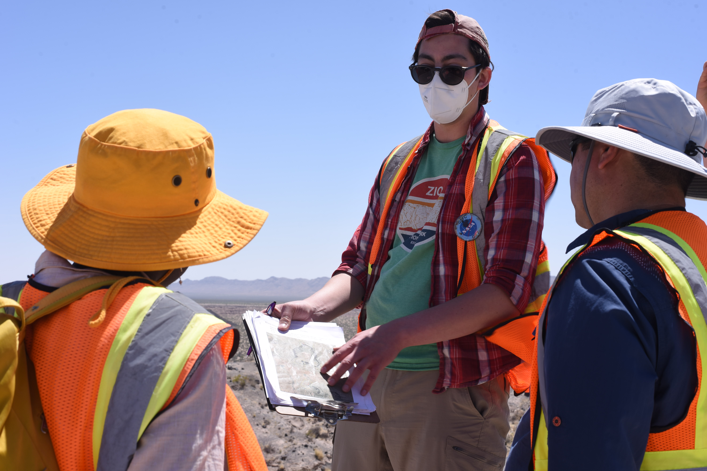

BY DEIDRE REDHEAD

Zach Morse wore a plaid, red flannel, and a white KN95 mask. Only his eyes were visible as he knelt down to inspect a small piece of olivine. 

Morse, a research assistant at NASA Goddard Space Flight Center, felt the mineral between his fingers.

“We think the Moon’s mantle is similar to the mantle on Earth, but we don’t have any samples that are definitive of that yet.” “Finding an olivine or pyroxene, or something like that, would be huge.”

Olivine and pyroxene are two of the crystals found at Kilbourne Hole. Quartz is the third — and most difficult — crystal to find. The Potrillo Volcanic Field where Kilbourne Hole is located, is a near-perfect match to the environment on the Moon.

If all three crystals are found in abundance in this location, it could mean the same for the lunar location for NASA’s next space mission.

Being the field lead for the EVA (extravehicular activity) traverses at Kilbourne and Hunt’s Hole, Morse knows exactly what he wants to accomplish: “How do technologies and instruments like the LIDAR (Light Detection and Ranging) interact with astronauts doing live science missions?”

At the end of every hour-long traverse, Morse has a questionnaire sectioned off into three parts — data, science objective, and operational objective. As the designer of the questionnaire and script, the idea is to see how astronauts “interact with data at one site and limited data at another site.”

As each site of a traverse decreases in the information available like maps and graphs, the goal is to extract more observations from scientists with questions like “What sample would you take?” and “What do you want to do next?” with the choose your own adventure style opportunity. 

But as a scientist, there is still so much that he wants to unpack about the history of craters, both when it comes to the number of volcanic eruptions each location underwent and how dated the rocks and crystals scattered across the desert are. 

On an actual space mission, there is limited time and limited oxygen. If the EVAs conducted in the field are done in an orderly, well-timed fashion, it ensures the scientists will be able to complete the actual mission successfully.

“We could send people and instruments to the Moon, but it wouldn’t be super-efficient in how we use their time,” Morse said.

Morse was born and raised in West Virginia where he received a bachelor of science degree in geology at West Virginia University. He attended Western University in London, Ontario for his Ph.D. in geology and planetary science where he held several positions at the university like research assistant and academic program designer. 

Now in New Mexico, he has set his sights on the RISE project and what it means for the future of space exploration in accordance with the Artemis mission, NASA’s ongoing space mission to put the first woman and person of color on the Moon by 2025.

“I hope that RISE2 will guide us in knowing which data is the most useful,” he said.

Almost every nightly debrief about the progress made in each group wouldn’t be complete without giving credit to Morse’s role in leading the EVA traverses at each location.

“Great job, Zach. Excellent job coordinating that this week,” said mineralogist Cherie Achilles.

Data lead Ben Feist echoed her sentiments saying, “Kudos again to Zach.”

Nandita Kumari, who worked closely alongside Zach doing notetaking of the scientists’ observations, praised his ability to walk through all of the EVAs in a successful run time.

“He’s a very good team player for sure,” Kumari said. “He’s a great team leader.”