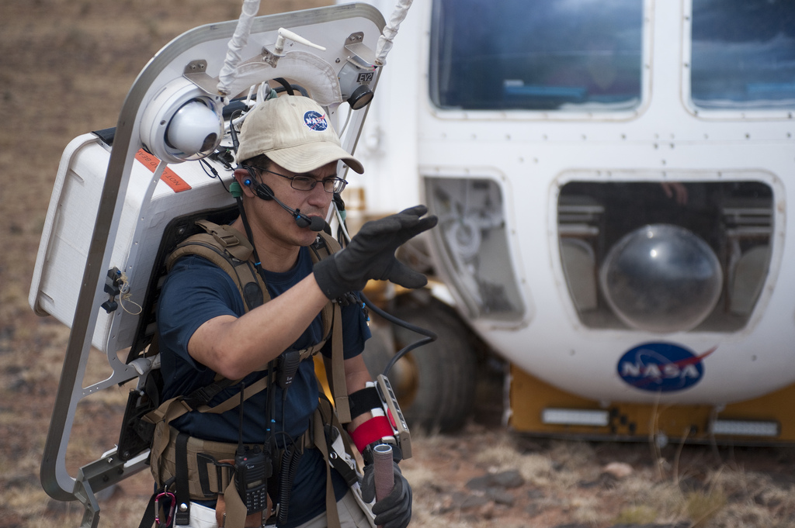

The four geology students and their professor hauled a tricked-out kids’ jeep turned Moon rover up the side of Kilbourne Hole in New Mexico. Their feet slid back in the sand with every step as they carried it up. After three pauses and some laughter, the team celebrated when they got to the top, then Professor José Hurtado took his team down into the crater to test out the rover on the rough terrain.

Hurtado wasn’t there on RISE2 business, despite being a big part of the program that was doing research in the area that day. He was there to help out his students from the University of Texas at El Paso. But exposing his students to the NASA research going on around Kilbourne Hole was a plus.

Later on, his students got a free lesson in teamwork as they tried to free their stuck UTEP van from the sand. Hurtado laughed it off and turned it into a learning experience.

“It's a legit and authentic field memory, because that's the kind of stuff that happens in the field,” Hurtado. “That's part of being educated and being a field scientist just to deal with things like that, contingencies.”

Hurtado knows all about working in the field. He’s completed research not just around the country, but around the world, as a seasoned geologist, from the Himalayas to New Mexico.

At the RISE2 program, everyone knows Hurtado and the work he’s done. 

He’s not only a local expert, but an Extravehicular Activity (EVA) team member and an astronaut trainer who has worked with NASA since the early 2000s. 

Hurtado knew he wanted to work with NASA long before he started his job there. Growing up, he was comforted by the sounds of aircraft near the Air Force Bases he grew up on. Aviation was exciting to him, and it's the reason he became a licensed pilot.

But Hurtado took it a step further. Before college he knew he wanted to work in the realm of space exploration. He chose planetary science as a major when he went to California Institute of Technology.

Even so, Hurtado slowly fell in love with geology, which is the degree he ended up graduating with. Even as a geologist, he still made it his mission to one day step foot on the Moon. Only one other geologist, Harrison Schmitt, has done so.

“I would say José would make an excellent member of either a future astronaut team for Artemis or a member of the mission control team,” Zach Morse, a RISE2 scientist and colleague of Hurtado, said. “He is at the perfect sweet spot of knowledge of the geology, the procedures, the ways to communicate everything from both the engineering perspective or the scientific perspective and just like the best like cool, calm demeanor.”

While NASA was the goal, Hurtado’s journey didn’t start there. Soon after receiving his bachelors and masters degrees in geology, Hurtado began his first grand geology adventure in the Himalayas through his PhD program at MIT.

He was 22 when he started his travels to South Asia to learn about the history and evolution of the mountain ranges in the Annapurna region. In most cases he traveled alone, collecting data and samples alongside a few locals there to show him the way and carry his equipment.

“It was really exciting work because you're out in remote mountainous areas,” Hurtado said. “It was fantastic. One of the greatest experiences of my life.”

The project was four years long and funded by the National Science Foundation (NSF). He would often stay about two months at a time, and he was able to visit the area four times.

When he completed his PhD program, Hurtado was unsure of his future.

“I was, as all graduate students, at that point you're thinking you know, what the heck am I gonna do next?” he said.

While he accepted a postdoc position at Jet Propulsion Laboratory, he began applying for faculty positions. He wasn’t necessarily enthusiastic about becoming a professor, but when he visited UTEP for his interview, he noticed the campus looked familiar. 

“I didn't really look into UTEP or do my homework at all. I don't know, I was just foolish when I was young,” Hurtado said. “So I got to UTEP and I see all these buildings, they look just like the buildings in my field area in Nepal. So I was really struck by that, it was a sign from God that I should take the job.”

Hurtado began at UTEP in 2002. During his time, he found even more connections between his prior research and UTEP. Several students were doing research in Bhutan – an area he hoped to extend his research from Nepal to, and he did. 

He has been a professor at UTEP for 20 years now. But his career hasn’t stopped there.

<figcaption class="rr-caption" align="center">Hurtado performs a simulated spacewalk during a NASA research mission in 2011. Photo courtesy of NASA/Regan Geeseman</figcaption>

Around 2008, Hurtado’s dreams of working with NASA came true when he started training astronauts in geology there. He even started applying and interviewing to become an astronaut himself.

Although he hasn’t reached astronaut status, he gets to be their teacher. In fact, Kjell Lindgren, a current astronaut on the International Space Station, was one of his first students. The training and workshops he’s completed with astronauts since then have evolved, especially with the new mission of getting people on the Moon in mind.

“It's kind of historical in a way,” Hurtado said. “I wonder if they'll be writing books about what we're doing right now. You know, 20 years from now.”

Hurtado's dreams of stepping foot on the Moon have come and gone, but now he has a new goal: working in mission control one day, maybe even for Artemis.