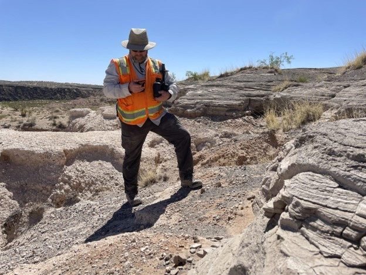

It just feels like we are on another planet.

That was the consensus among the arriving students at Kilbourne Hole, New Mexico. On a swelteringly hot day in the middle of the desert, seemingly undisturbed by human settlement, one would not be alone in mistaking it for the famous desert planets of Tatooine from Star Wars or Arrakis from Dune. 

All that means is that NASA and the RISE2 team did their jobs right.

Kilbourne Hole is just one of many “planetary analog sites”, or sites that are considered geographically, astrobiologically or compositionally similar to other known planetary bodies in our Solar System and beyond. NASA and the RISE2 team utilize Kilbourne Hole and other sites across the planet to conduct research and tests that will inform the next generation of extraterrestrial exploration.

With NASA’s renewed focus being set upon placing humans on the Moon again in 2024 and the ultimate goal being a sustainable moon colony a few years after that, the RISE2 team has returned to Kilbourne Hole (and its sister site Hunt’s Hole to the south) to provide analog data for potential moon-like scenarios. 

“If you were to imagine an impact crater on the moon, it would eject lots of different materials out into the surface,” Dr. Stephen Scheidt remarks about Kilbourne Hole while taking UAV data of the site with his drone. “The crater here is quite similar \[to the Moon] in that respect.”

The site has an extensive history as an analog site for the Moon, dating back to January 1971 when the crew of Apollo 15 trained at the site to collect volcanic samples ahead of their mission to the Moon just six months later from July to August of that same year.

Much of the work being done today is similar to those conducted by the Apollo 15 team: simulated extravehicular activities, or EVAs, which are research missions that astronauts on the Moon or Mars or any planetary body conduct while on their mission. These simulated missions at Kilbourne range from topographic surveys of the surface, to geological comparisons of the differing rock formations and compositions that layer the surrounding area, to general feedback from the “astronauts” on what data proved to be most useful in determining information about the “new planet” they had arrived on.

“With this location being volcanic, and for other locations in the solar system, we are interested to see if we can find and recognize samples that are also volcanic on other planets,” Dr Scheidt stated.

According to NASA’s website, there are a variety of different planetary analog sites across the world that serve various purposes. Researchers have spent time in the Chilean Atacama desert, which has served as a planetary analog for Mars ahead of which NASA has plans to send humans to for the first time within the next decade or so after more extensive work on the Moon has been accomplished within the next few years.

“Ground truth science on Earth provides valuable information about our home planet,” the website reads. “It also helps us to check our understanding of satellite imagery. When long-distance observations of Earth match with data gathered on the ground, we can be confident about using remote sensing on other worlds, too.”

Others attempting to simulate the conditions of Jupiter’s ice moon of Europa, whose liquid oceans beneath the ice has led scientists to believe that it is the most likely place in our solar system to have the conditions necessary to sustain life outside of Earth, have spent time living upon ice sheets in Greenland to better prepare for what might be encountered in a future manned mission. Finally, some researchers have even studied the harshest underwater volcanic environments like the Lō`ihi seamount in Hawaii to better understand how life might survive on the other planetary bodies in our solar system and possibly beyond.

Thus as NASA continues their rapid approach towards returning to extraplanetary missions with humans again, these analog sites right here on Earth continue to provide the first steps towards preparing humans for life across the cosmos.

As NASA.com concludes, “analog studies have already changed the way we understand our place in space, and there are many discoveries left to make. Future scientists, engineers, and astronauts will have exciting questions to answer. To succeed, they'll need to learn all they can from each other and our home planet.”

**For the love for simplicity and helping everyone**

Despite now being on a mission with NASA level funding, and with colleagues sporting equipment the cost of a college fund, Dr. Stephen Scheidt likes to keep his equipment simple, cost-effective and personal. 

“It was mostly born out of a lack of funding,” Dr. Scheidt says driving his beat up rental Toyota across the sandy tracks of the New Mexican desert. “I was always asking myself ‘What hardware is available to me right now and what solutions can I come up with based on what it is capable of doing?’”

It is a call back to the way he used to work on his equipment when he was not backed by the largest scientific organization in America. He would rather spend the time and effort than spend the money if he can, mostly because it is a rewarding feeling to come up with something new that can help discover something new about the world we live in.

“I mean it is great to find rocks, but what about understanding the layer deposits that tell a much greater story about our planet?”

Dr. Scheidt is a man of many backgrounds and talents. He received his Bachelor’s of Science from the University of Toledo in 1999 in Environmental Science before he received two post-graduate degrees in Geology (a Master’s from South Carolina in 2002 and a PhD from Pittsburgh in 2009) and has studied in various coinciding fields from thermal spectroscopy to topography to photogrammetry and much more. This wide variety of experiences and knowledge makes him a valued member of the Howard University Department of Physics, and an integral part of the RISE2 mission where he is always looking to put himself to good use whenever and however he can.

‘I try to help people on these missions however I can. Whether that’s working on a drone or getting a van unstuck from the sand, I just want to help.”

One of Dr. Scehidt’s key objectives on the RISE2 mission was providing UAV data with drone technology. Simulating a satellite image taken of a planetary surface, his images provide the other scientists with the necessary information to help traverse the desert terrain in a realistic manner to that of astronauts on another planet. 

True to form, Dr. Scheidt does not have some fancy high-tech multi-million dollar drone you would expect from a NASA scientist. Instead, like he always does, he keeps it much simpler and cheaper.

“As far as drone tech, I’ve been using commercial off-the-shelf drones,” Dr Scehidt said. “ I’ve used the Trimble UX5-HP for much of my work in the past, DJI Phantom, DJI Mavic 2 Pro, and the Blackswift Technologies E2. They’re very good, and they do a good job if you know what you’re doing, which I do.”

In addition to his passion projects of working on new innovative technologies that can be made under $500 with enough time and elbow grease, Dr. Scheidt is looking to continue to further his knowledge in spectral imaging and geospatial camera systems. Each would help NASA, and more importantly everyone else, understand the natural world around them just a little better. These are just par for the course: simple goals for the man who loves to find simplicity and accessibility in science and technology.